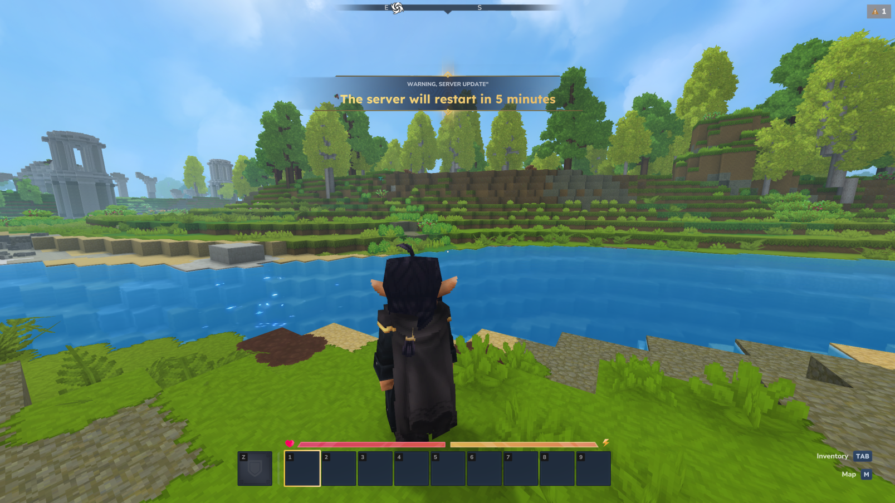
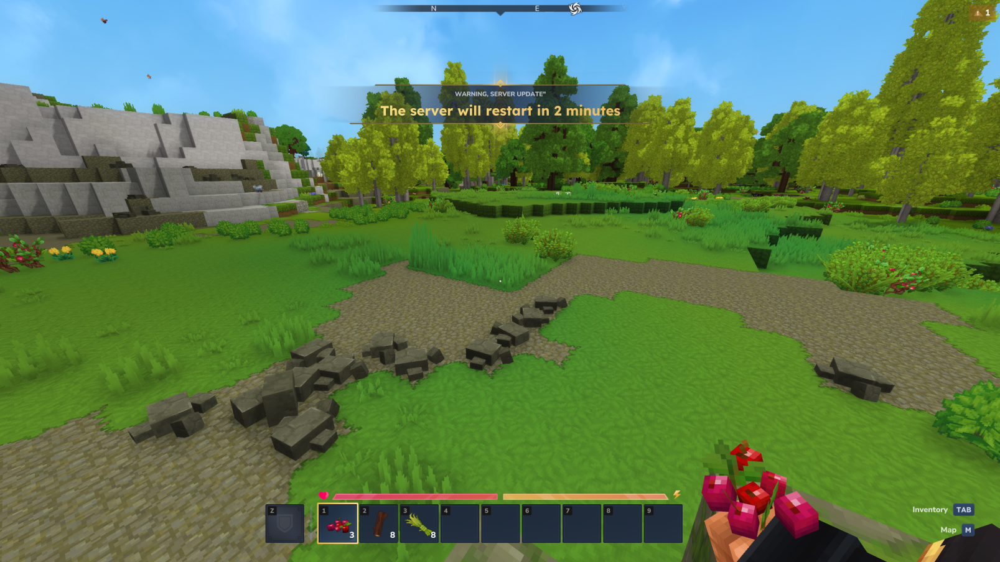
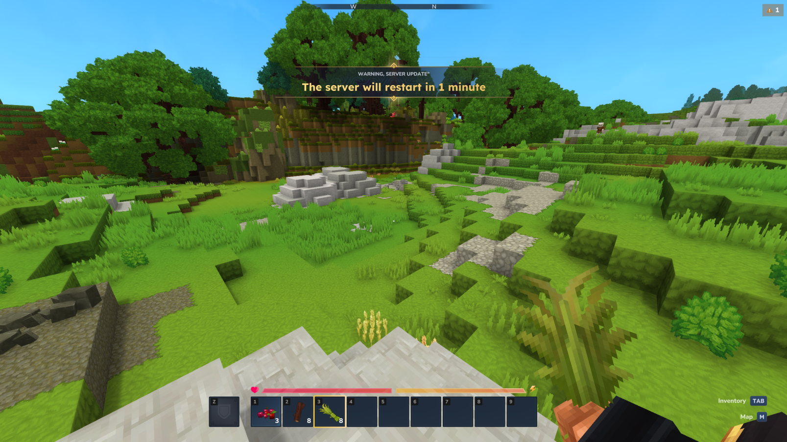
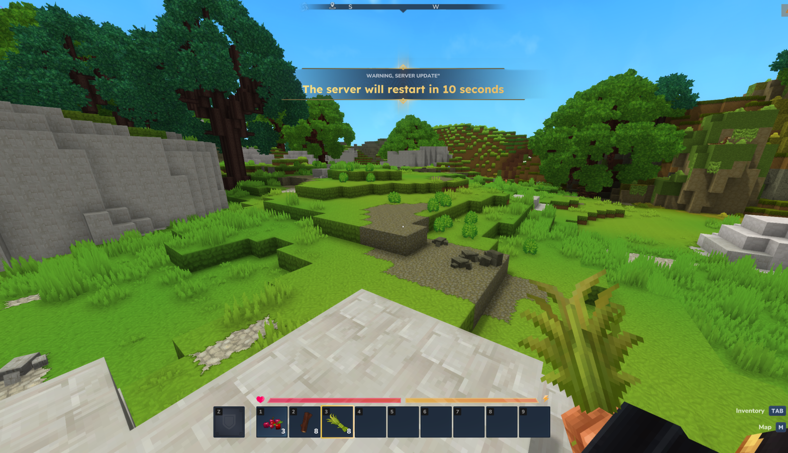
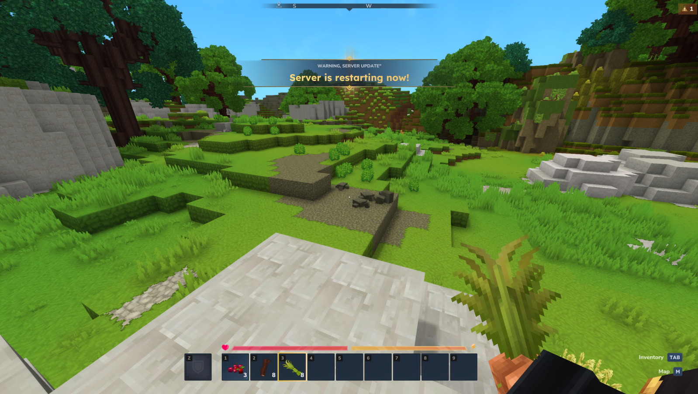

# Hytale Docker Server
A high-performance, automated Docker image for running Hytale servers with Java 25. This project features automated updates, secure OAuth2 Device Flow authentication, and optimized memory management for low-latency gaming.

[](https://hub.docker.com/r/ocelus/hytale-docker-server)
[](https://hub.docker.com/r/ocelus/hytale-docker-server)
[](https://hub.docker.com/r/ocelus/hytale-docker-server)
[](https://github.com/oceluspro/hytaledockerserver/actions)
[](https://github.com/oceluspro/hytaledockerserver)
## Features

- **Java 25 Runtime**: Leverages the latest JVM for high performance, with support for modern garbage collectors like Generational ZGC.
- **Headless OAuth2 Authentication**: Utilizes the RFC 8628 Device Flow for a secure, browser-based authentication process without exposing account credentials to the container.
- **Automated Server Updates**: Automatically checks for and downloads the latest Hytale server version on startup. It also monitors for updates during runtime and notifies players before restarting to apply the update.
- **Persistent Sessions**: Securely stores and refreshes authentication tokens in a volume, maintaining your server's identity across restarts.
- **Alpine Linux Optimized**: A lightweight base image with `gcompat` and automated `machine-id` generation to ensure full compatibility with native libraries (e.g., Netty/QUIC).
- **Security-Focused**: Runs as a non-root user within the container for improved security.
- **Highly Configurable**: Easily manage JVM, server, and game settings using environment variables.

## Quick Start

### Prerequisites

- [Docker](https://docs.docker.com/get-docker/)
- [Docker Compose](https://docs.docker.com/compose/install/)

### Basic Setup

1.  Create a `docker-compose.yml` file in your server directory:

    ```yaml
    services:
      hytale:
        image: ocelus/hytale-docker-server:latest
        container_name: hytale
        ports:
          - "5520:5520/udp"
        volumes:
          - ./hytale-data:/game
        restart: unless-stopped
    ```

2.  Launch the server:

    ```bash
    docker-compose up
    ```
    

Deployment Examples

You can find various configuration templates in the [samples](./samples) directory of this repository. These examples demonstrate different use cases, including High Performance setups using Generational ZGC, Standard community configurations, and Debug modes for development. Each sample is designed to help you quickly deploy a Hytale server tailored to your specific needs.

### First-Time Authentication

On the first launch, you need to authorize the server with your Hytale account:

1.  Watch the container logs for an authorization message.
2.  You will see a URL and a user code, similar to this:
    ```
    [HytaleDockerServer] [    2024/01/01 12:00:00        WARN]      [AUTH] ACTION REQUIRED: Please authorize this Hytale server
    [HytaleDockerServer] [    2024/01/01 12:00:00        WARN]      [AUTH] URL  : https://accounts.hytale.com/device
    ```
3.  Open the provided URL in a browser and enter the code to grant access.
4.  The server will automatically detect the completed authorization, generate session tokens, and finish starting. Authentication tokens will be stored in your volume, so you only need to do this once.

> *Note : The downloader will request a second authentication to download the server in its latest version and check for updates..*


## Configuration

### Environment Variables

You can customize your server using the following environment variables.

| Variable               | Description                                                                                | Default                                               |
|:-----------------------|:-------------------------------------------------------------------------------------------|:------------------------------------------------------|
| **JVM Settings**       |                                                                                            |                                                       |
| `XMX`                  | Maximum Java heap size.                                                                    | `4096M`                                               |
| `XMS`                  | Initial Java heap size.                                                                    | `2048M`                                               |
| `GC_TYPE`              | Garbage Collector type. Can be `g1gc` or `zgc`.                                            | `g1gc`                                                |
| `GC_ARGS`              | Additional arguments for the garbage collector.                                            | (Defaults based on `GC_TYPE`)                         |
| `USE_AOT`              | Enable Hytale's Ahead-of-Time (AOT) compilation file for faster startups (`true`/`false`). | `false`                                               |
| `JVM_ARGS`             | **Overrides all other JVM arguments.** Use this for full control.                          | `(empty)`                                             |
| **Server Settings**    |                                                                                            |                                                       |
| `SERVER_PATH`          | The container path where server files are stored.                                          | `/game`                                               |
| `SERVER_IP`            | The IP address for the server to bind to.                                                  | `0.0.0.0`                                             |
| `SERVER_PORT`          | The port for the server to listen on.                                                      | `5520`                                                |
| `ENABLE_SENTRY`        | Enable Sentry error reporting (`true`/`false`).                                            | `true`                                                |
| `OWNER_UUID`           | The UUID of the server owner. Required for certain commands.                               | `(empty)`                                             |
| `SERVER_ARGS`          | **Overrides all other server arguments.** Use for advanced configuration.                  | `(empty)`                                             |
| **Game Configuration** |                                                                                            |                                                       |
| `SERVER_NAME`          | The name of the server displayed in-game.                                                  | `Hytale Server`                                       |
| `SERVER_MOTD`          | The Message of the Day for the server.                                                     | `(empty)`                                             |
| `SERVER_PASSWORD`      | The password required to join the server.                                                  | `(empty)`                                             |
| `MAX_PLAYERS`          | The maximum number of players allowed on the server.                                       | `100`                                                 |
| `MAX_VIEW_RADIUS`      | The maximum view radius for players.                                                       | `32`                                                  |
| `WHITELIST_ENABLED`    | Enable or disable the whitelist (`true`/`false`).                                          | `false`                                               |
| `WHITELIST_LIST`       | A comma-separated list of player UUIDs to add to the whitelist.                            | `(empty)`                                             |
| `WHITELIST_MODE`       | How to apply `WHITELIST_LIST`. `add` appends to existing list, `override` replaces it.     | `add`                                                 |
| `OPS_LIST`             | A comma-separated list of player UUIDs to grant OP permissions.                            | `(empty)`                                             |
| `OPS_MODE`             | How to apply `OPS_LIST`. `add` appends to existing OPs, `override` replaces them.          | `add`                                                 |
| **System & Updates**   |                                                                                            |                                                       |
| `ENABLE_AUTO_UPDATE`   | Enable the runtime update checker (`true`/`false`).                                        | `true`                                                |
| `AUTO_UPDATE_CRON`     | The cron schedule for checking for updates.                                                | `*/30 * * * *` (every 30 minutes)                     |
| `DOWNLOADER_URL`       | The URL for the Hytale downloader zip file.                                                | `https://downloader.hytale.com/hytale-downloader.zip` |
| `DTERM_JLINE`          | Enable JLine support for the interactive terminal (`true`/`false`).                        | `true` if tty is allocated                            |
| `DTERM_ANSI`           | Enable ANSI color support in the terminal (`true`/`false`).                                | `true`                                                |

#### Persistent Volumes

- `/game`: (can be changed with `SERVER_PATH` env var) This is the main directory for server files, world data, and authentication tokens. This must be persistent to avoid re-authenticating and save loss on every restart.

### Configuration Files

On the first run, the server will generate default configuration files in your volume at `<SERVER_PATH>/Server/`:
- `config.json`: Main server settings like name, MOTD, and player limit.
- `permissions.json`: Manages user and group permissions, including OPs.
- `whitelist.json`: Manages the server's player whitelist.

These files are automatically managed on startup by the environment variables listed above (`SERVER_NAME`, `OPS_LIST`, etc.). You can also edit them directly while the server is offline.

> Note : Remember to remove environment variables if you manually edit configuration files; if these variables are added, the configuration will be modified accordingly.


## Auto-Update

In addition to automatically using the latest available version when the container starts, the server will check for updates throughout its lifecycle.

When an update is detected, the server will notify players a few minutes before restarting to install the latest version.

</img> </img> </img> </img> </img> </img> 

## Pterodactyl Panel

> Work in progress ! *(currently not tested, can't guarantee it will work)*

To use this image with Pterodactyl Panel, you can import the [`hytale-server-egg.json`](./hytale-server-egg.json) file.

1.  Navigate to your Pterodactyl Admin area.
2.  Go to the "Nests" section.
3.  Select the Nest where you want to add the Hytale server.
4.  Click "Import Egg" and upload the `hytale-server-egg.json` file.
5.  You can now create a new server using the "HytaleDockerServer" Egg.

## Star History

[](https://www.star-history.com/#OcelusPRO/HytaleDockerServer&type=date&legend=top-left)